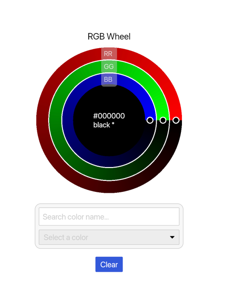
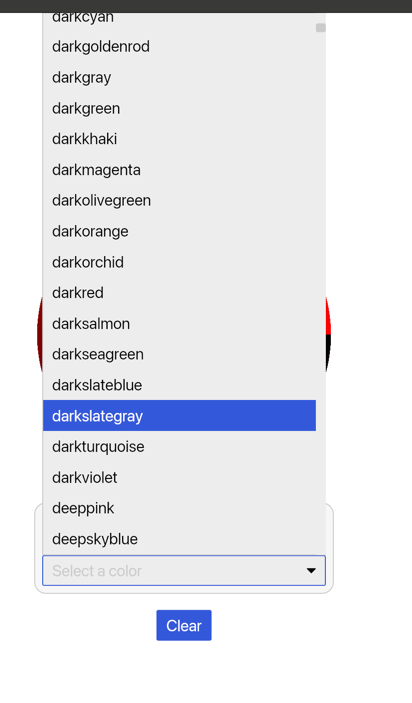
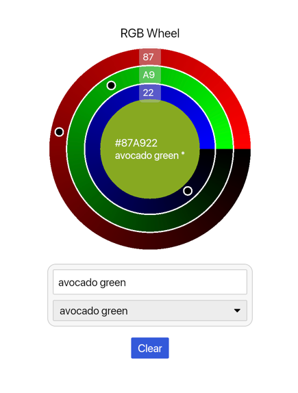

# rust_colors

A comprehensive Rust color management application with an interactive GUI built on the Iced framework. Features multiple color palette sources, real-time search, and an intuitive color wheel interface for exploring and working with colors.

## Features

### 🎨 **Multiple Color Palettes**
- **CSS Colors**: Standard web colors (140+ colors)
- **XKCD Colors**: Community-sourced color names (900+ colors)
- **Pantone Colors**: Professional color standards
- **Brand Colors**: Popular brand color palettes
- **Cultural Palettes**: Hindi, Persian, Italian brand colors
- **Specialized Sets**: National colors, Kelvin temperature colors, metal flame colors
- **GitHub Colors**: Community-contributed color palettes (feature-gated)

### 🔍 **Powerful Search Engine**
- Real-time substring search across all color names
- Token-based indexing for fast queries
- Multi-word search support
- Origin-based filtering (search within specific palettes)
- Keyboard navigation (Up/Down arrows, Enter to select)

### 🎡 **Interactive Color Wheel**
- Concentric RGB rings for intuitive color selection
- Real-time hex input synchronization
- Visual feedback with color preview
- Click-to-copy hex values
- Smooth canvas-based rendering

### 🛠 **Developer-Friendly Library**
- **Hex utilities**: Normalize, validate, and convert hex colors
- **RGB utilities**: RGB struct with distance calculations
- **Color matching**: Find nearest named colors
- **Modular design**: Use as library or standalone application

## Installation & Quick Start

### Running the Application

Clone and run the standalone color picker application:

```bash
git clone https://github.com/LaurentiusCanadensis/rust_colors
cd rust_colors
cargo run
```

### Using as a Library

Add to your `Cargo.toml`:

```toml
[dependencies]
rust_colors = { git = "https://github.com/LaurentiusCanadensis/rust_colors" }
iced = { version = "0.13", features = ["advanced", "canvas"] }  # For GUI widgets
```

### Feature Flags

Control which color palettes are included:

```toml
[dependencies]
rust_colors = {
    git = "https://github.com/LaurentiusCanadensis/rust_colors",
    features = ["github-colors"]  # Enable GitHub community colors
}
```

Available features:
- `github-colors`: Adds thousands of community-contributed colors (⚠️ increases binary size)
- `profile`: Enables tracing/debugging output

## Usage Examples

### Library Usage - Color Utilities

```rust
use rust_colors::{hex_to_rgb, rgb_to_hex, normalize_hex, Rgb, COLORS_CSS};

fn main() {
    // Hex normalization and validation
    let normalized = normalize_hex("#3af").unwrap(); // -> "#33AAFF"

    // RGB conversions
    let rgb = hex_to_rgb(&normalized).unwrap(); // Rgb { r: 51, g: 170, b: 255 }
    let hex_back = rgb_to_hex(rgb);            // "#33AAFF"

    // Color distance calculation
    let color1 = Rgb { r: 255, g: 0, b: 0 };   // Red
    let color2 = Rgb { r: 0, g: 255, b: 0 };   // Green
    let distance = rust_colors::dist2(color1, color2); // Euclidean distance squared

    // Access color palettes
    println!("CSS colors available: {}", COLORS_CSS.len());
    if let Some((_hex, name)) = COLORS_CSS.first() {
        println!("First CSS color: {}", name);
    }
}
```

### Library Usage - Color Search

```rust
use rust_colors::{colors_helper::{Origin, best_first_for_ui}, COMBINED_COLORS};

fn main() {
    // Search for colors by name
    let results = best_first_for_ui("blue", Origin::All, 10);
    for (hex, name, _score) in results {
        println!("{}: {}", name, hex);
    }

    // Filter by specific palette
    let css_blues = best_first_for_ui("blue", Origin::Css, 5);
    println!("Found {} CSS blue variants", css_blues.len());

    // Access all colors
    println!("Total colors available: {}", COMBINED_COLORS.len());
}
```

### Widget Integration

```rust
use iced::{application, Element, Theme, widget::container};
use rust_colors::{widgets::color_wheel::ColorWheel, messages::{Msg, Channel}};

#[derive(Default)]
struct ColorApp {
    r: u8,
    g: u8,
    b: u8,
}

impl ColorApp {
    fn view(&self) -> Element<Msg> {
        let wheel = ColorWheel::new(self.r, self.g, self.b, Msg::WheelChanged);

        let wheel_view = wheel.view(
            "Color Picker",
            &format!("{:02X}", self.r),
            &format!("{:02X}", self.g),
            &format!("{:02X}", self.b)
        );

        container(wheel_view).into()
    }

    fn update(&mut self, msg: Msg) {
        match msg {
            Msg::WheelChanged(channel, value) => {
                match channel {
                    Channel::R => self.r = value,
                    Channel::G => self.g = value,
                    Channel::B => self.b = value,
                }
            }
            _ => {}
        }
    }
}
```

---

## API Reference

### Core Modules

#### `hex` - Hex Color Utilities
```rust
// Normalize various hex formats to #RRGGBB
normalize_hex("#3af") -> "#33AAFF"
normalize_hex("#33AAFF") -> "#33AAFF"
normalize_hex("#33AAFFCC") -> "#33AAFF"  // strips alpha

// Split and combine hex components
split_hex("#33AAFF") -> ("33", "AA", "FF")
combine_hex("33", "AA", "FF") -> "#33AAFF"

// Name lookups
hex_for_name("tomato") -> Some("#FF6347")
name_for_hex("#FF6347") -> Some("tomato")
```

#### `rgb` - RGB Color Utilities
```rust
// RGB struct and conversions
Rgb { r: u8, g: u8, b: u8 }
hex_to_rgb("#FF6347") -> Rgb { r: 255, g: 99, b: 71 }
rgb_to_hex(rgb) -> "#FF6347"

// Color distance (Euclidean squared)
dist2(color1, color2) -> u32
```

#### `colors_helper` - Search and Catalogs
```rust
// Origin-based color filtering
Origin::All | Origin::Css | Origin::XKCD | Origin::Pantone | ...

// Search functions
best_first_for_ui(query: &str, origin: Origin, limit: usize)
  -> Vec<(&str, &str, u32)>  // (hex, name, score)

// Color collections
COMBINED_COLORS  // All colors from all palettes
COLORS_CSS       // Web-standard colors
COLORS_XKCD      // Community colors
// ... and more
```

#### `widgets::color_wheel` - Interactive GUI Component
```rust
ColorWheel::new(r: u8, g: u8, b: u8, on_change: F) -> Self
.view(title: &str, r_hex: &str, g_hex: &str, b_hex: &str) -> Element<Msg>
.view_with_search_props(...) -> Element<Msg>  // Includes search dropdown
```

## Color Palettes Included

| Palette | Count | Description |
|---------|-------|-------------|
| CSS | 140+ | Standard web colors |
| XKCD | 900+ | Community-sourced color names |
| Pantone | 200+ | Professional color standards |
| Hindi | 100+ | Traditional Hindi color names |
| Persian | 100+ | Traditional Persian color names |
| Brand Colors | 50+ | Popular brand palettes |
| Italian Brands | 30+ | Italian brand colors |
| National Colors | 200+ | Flag and national colors |
| Metal Flames | 20+ | Metal flame temperature colors |
| Kelvin Colors | 100+ | Temperature-based colors |
| GitHub Colors* | 1000+ | Community contributions |

*GitHub colors require the `github-colors` feature flag.

## Screenshots







## Development

### Building and Testing

```bash
# Build the application
cargo build

# Run tests
cargo test

# Run with all features
cargo run --features github-colors

# Build optimized release
cargo build --release
```

### Performance Notes

- Color search uses pre-built token indices for fast substring matching
- Lazy loading of color palettes reduces startup time
- The `github-colors` feature significantly increases binary size due to large datasets
- Memory usage scales with enabled color palettes

### Architecture

The project follows a modular design:

```
src/
├── main.rs           # Application entry point
├── lib.rs            # Library interface and re-exports
├── colors/           # Color palette modules
├── colors_helper/    # Search, indexing, and utilities
├── app_gui/          # Iced application logic
├── widgets/          # Custom UI components
├── rgb.rs            # RGB utilities
├── hex.rs            # Hex color utilities
└── messages.rs       # Application message types
```

## Contributing

1. Fork the repository
2. Create a feature branch (`git checkout -b feature/amazing-feature`)
3. Commit your changes (`git commit -m 'Add amazing feature'`)
4. Push to the branch (`git push origin feature/amazing-feature`)
5. Open a Pull Request

## License

MIT © 2025 LaurentiusCanadensis
